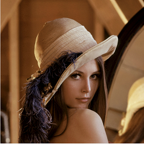
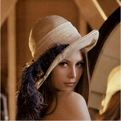
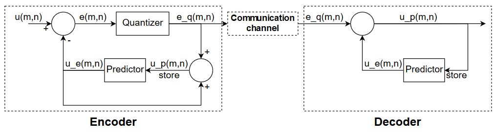

# DPCM encoder-decoder

 

This repository contains an example of Differential Pulse-Code Modulation (DPCM) written in MATLAB. It was a programming exercise for an image processing course. I cleaned it up and uploaded it here for anyone interested in understanding the algorithm.

The code is definetely not optimized but written as to be easily understood. This README provides some theorethical background and insights about implementation choices.

## How to use the encoder-decoder

This repository contains 3 MATLAB files: one for the encoder function,another for the decoder, as well as an [example script](example.m).

The encoder-decoder can act on images stored as a matrix. the function `error = DPCM_encoder(image, error_quantization_levels)` can be used to compute the quantized errors that would be sent over the transmission channel. The second parameter defines the number of quantization levels for the error. The higher it is, the closer the reconstructed image will be to the original image; the smaller it is, the less information would need to be sent.

The image can then be reconstructed with `image_r = DPCM_decoder(error)`.

Here is an example with a gray-scale image, where the error was quantized on 8 levels (only 3 bits per pixel instead of 8 bits).

 

For a color image, it must first be converted to a single matrix. It is best for this implementation to run the encoder-decoder separately on the 3 color channels (RGB), rather than concatenating the 3-channels into a 2D-matrix.

Here is an example with a color image, where the error was quantized on 16 levels. Here only 3 \* 4 bits pixel would need to be transmitted (instead of 3 \* 8 bits).

 

## Theorethical background

This section provides some theorethical background and insights about implementation choices.

### DPCM encoder principle

Differential Pulse-Code Modulation (DPCM) is an encoding technique with typical applications in data transmission. The goal is to reduce the amount of information that is sent over a transmission channel so that it faster and easier to check its integrity. The DPCM can also introduce some controlled loss of information to further reduce the amount of data to be transmitted.

The DPCM technique works in 3 steps: the information to be sent (here an image) is encoded, then transmitted over a communication channel (optical fiber, wires, RF, ...) and decoded on the other side of the channel. The encoder and decoder work in a very similar way.

The image that is to be encoded is here a gray scale image, but the provided example shows how to encode a color image. Here each pixel of the image is 8-bit (256 different gray levels), so it is a discrete signal. The implemented algorithm can be modified and adapted to suit any input signal, and the DPCM technique can be applied similarly to both continuous and discrete signals.

The overall mechanism of the encoder is based on an predictor of the signal, that is an predict of the value of the next transmitted pixel knowing the value of the ones previously sent. The error between the predicted value and the actual value is then computed, quantized and sent over the communication channel. Indeed it is not directly the value of the pixels that is sent but rather the error compared to the predictor.

The decoder use the same predictor as the encoder, and will use the received values of the error to reconstruct the image. Two major ingredients compose the encoder and decoder: the predictor and the way the error is quantized. Both components are described more in detail in the following explanation.

### Block diagram

Here is a block diagram summarizing the previous explanation.

#### Encoder:
1. Read a sample of the signal.
2. Compute the error compared to the predictor.
3. Quantize the error
4. Add the quantized error to the predict and keep this value to be used by the predictor for the following samples.

#### Transmission
We assume that the signal is perfectly sent, with no added noise or corrupted samples.

#### Decoder
1. Receive data (quantized error).
2. Compute the predict the value of the sample.
3. Add the error and predict together to retrieve signal value (pixel).
4. Keep this value to be used by the predictor for the following samples.

### predictor choice

The predictor can be freely chosen to best suit the targetted application. It must be a causal predictor and use only, meaning that it only uses the values of the signal that were already sent. Depending on the nature of the signal, you might want to use an predictor that looks at a lot of past samples or one that looks only at a couple. Also for more than 1D-signal, like images in our case, you might want to decide in which order you sent the dimensions. Indeed there might be more correlation between succesive elements by sending in a specific order. For instance, in images typically one pixel is highly correlated to its neighbors, so you might want to use those pixels for the predictor. However, the predictor has to be causal so not all neighbors can be used; here we use the neighbors on the top left side and thus the image must be read in a specific order so that the values needed for the predictor are sent before they are used by it.

Considering the choice for the formula used to compute the predictor based on the previous values, it has to be taylored to the signal your sending. Here for the sake of simplicity, we arbitrarly use the formula:

u_e(m,n) = 0.95 \* u_p(m-1,n) + 0.95 \* u_p(m,n-1) - 0.95^2 \* u_p(m-1,n-1)

Depending on the signal, you might want to use more previous samples for prediction.

### Quantization of error

This u_e(m,n) value is then compared to the actual signal u(m,n) to compute the error:

e(m,n) = u_e(m,n) - u(m,n)

The error is then quantized, so as to reduce the amount of information to send over the transmission channel.

In this code, again for the sake of simplicity the error is uniformly sampled over the range [-255; +255] (since the pixel values of image are in the range [0; 255]). To reduce the information loss the Quantization can be non-uniform if a smaller range of error occurs more often.

### predictor update

The quantized error is sent over the transmission channel (here just saved in an array). In order to compute the next value of the error we need to update the predictor:

u_p(m,n) = u_e(m,n) + e_q(m,n)

### Decoding the error

On the other side of the transmission channel, the quantized error are received one after the other. These error are used to recreate the signal using the same predictor as previously.

Say we receive quantized_error(m,n). Then the resulting reconstructed signal value is the following:

u_p(m,n) = u_e(m,n) + e_q(m,n) = 0.95 \* u_p(m-1,n) + 0.95 \* u_p(m,n-1) - 0.95^2 \* u_p(m-1,n-1) + e_q(m,n)

Again as in the encoder, the predictor on the receiving end must be stored (u_p(m,n)) in order to compute the next values.

## Contributing

This project is not maintained.

## Author

**Thomas Havy**

## License

This project is licensed under the MIT License - see the [LICENSE](LICENSE) file for details.
